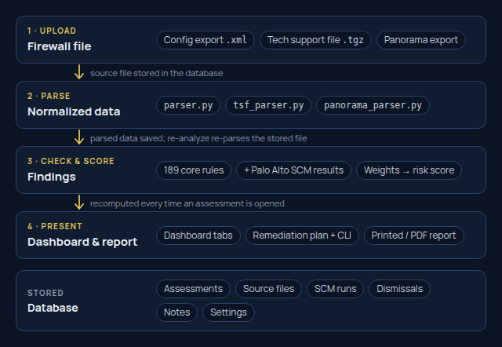

# PA BPA Dashboard — Project Guide

A complete guide to the **PA BPA Dashboard**: what it does, how it's built, and how a firewall configuration becomes a scored report.

## Overview

The PA BPA Dashboard is a **best-practice assessment (BPA) tool for Palo Alto Networks firewalls**. An engineer uploads a firewall's configuration (a config export, a tech support file, or a Panorama export), and the dashboard grades it against published best practice, explains every gap, groups the fixes into a remediation plan, and prints a branded client report. It ships branded for **Harborlight Consulting**, a fictional firm; put your own name and logo on it with a [brand pack](#branding).

It replaces an older script pipeline (`collect_data.py` → `generate_report.py` → `.docx`) with an interactive web app: findings can be filtered, dismissed, annotated and compared between runs instead of living in a static Word file.

| | |
|---|---|
| **Repository** | `phmcgann/pa-bpa-public` |
| **Backend** | Python · FastAPI · SQLModel (SQLite by default, Postgres supported) |
| **Frontend** | React 19 · Vite · TypeScript · Tailwind CSS v4 |
| **Checks** | 190 core rules (181 on by default), 133 of them mapped to 187 Palo Alto SCM checks |
| **Inputs** | PAN-OS config export (XML), tech support file (`.tgz`), Panorama export (per device group) |
| **Outputs** | Interactive dashboard, printable/PDF report with cover, sections and appendix |

## Install

On **Windows** or **macOS**, install [Docker Desktop](https://www.docker.com/products/docker-desktop/), then paste one line:

**Windows** (PowerShell):
```powershell
irm https://github.com/phmcgann/pa-bpa-public/releases/latest/download/install.ps1 | iex
```

**macOS** (Terminal):
```bash
curl -fsSL https://github.com/phmcgann/pa-bpa-public/releases/latest/download/install.sh | bash
```

It opens the dashboard at `http://localhost:8080` and prints your login. Run the same line again to update.
**[Step-by-step install guide](docs/INSTALL.md)** (every click spelled out), plus server deployment, backups and troubleshooting.

## How It Works



1. **Upload.** The file is validated (it must be a PAN-OS configuration), parsed into a normalized data shape, and the original source is stored so it can be re-analyzed or sent to Palo Alto SCM later.
2. **Parse.** Three parsers produce the same shape: a firewall config export, a tech support file (config plus CLI output for system info, licenses and HA state), or one device group of a Panorama export (shared + device-group objects and pre/post rulebases, with template settings resolved).
3. **Check and score.** Findings are **computed live every time an assessment is opened**, from the stored parsed data and the current rule settings. Changing a rule's severity, disabling a rule or adjusting scoring weights updates every assessment immediately.
4. **Present.** The dashboard shows the score, findings and analysis in tabs; the same view prints as a report.

## Dashboard Tour

| Tab | What it shows |
|---|---|
| **Executive summary** | One-page, plain-language summary: overall risk, what matters most, and the top pieces of work |
| **Overview** | Findings by category and severity (click a segment to filter), system and HA details, top findings |
| **Remediation plan** | Scored findings grouped into work items (upgrade PAN-OS, attach profiles, harden profiles, lock down management…), ordered by urgency, each with copy-ready CLI commands where possible |
| **Findings** | Every finding with search and filters (severity, category, source), dismiss/restore, notes, and per-finding CLI fixes |
| **Policy & decryption** | Threat-intel blocking coverage, security rules, shadowed/redundant rules, unused and duplicate objects, NAT review, decryption policy |
| **Security profiles** | What each antivirus, anti-spyware, vulnerability, URL filtering, file blocking and WildFire profile actually has configured |
| **Network & access** | Zones and zone protection, management-plane exposure and reachability, DoS protection, VPN, certificates |
| **GlobalProtect** | Portal and gateway hardening |
| **Changes since last run** | New, resolved and changed findings versus the same firewall's previous assessment |
| **Palo Alto SCM** | Palo Alto's own BPA results (when run) and the core-vs-SCM coverage-gap view |
| **Notes** | Numbered appendix of analyst notes (appears once a note exists) |

The KPI tiles above the tabs (Critical, Warning, Low, Informational) filter the Findings tab; clicking the active tile or **Overall risk** clears the filter.

## Scoring

Each active finding adds points by severity; the total sets the overall risk level.

| Severity | Default weight |
|---|---|
| Critical | 10 points |
| Warning | 5 points |
| Low | 2 points |
| Informational | 1 point |

| Total score | Risk level |
|---|---|
| 0 | Informational |
| 1 – 15 | Low |
| 16 – 40 | Warning |
| over 40 | Critical |

Weights and thresholds are editable in **Settings**. A finding doesn't count when it's **dismissed**, when it's on a **disabled security rule**, or when it's a **Palo Alto SCM result that repeats a core finding** for the same object (listed, not scored twice). SCM results can also be excluded from the score entirely.

## The Checks

The **core rules** are the dashboard's own rule set, labelled on screen and in reports with the brand's name for it (**Harborlight BPA** by default). Each rule records what it's based on: Palo Alto's published best-practice documentation (83 rules), the CIS Palo Alto Firewall Benchmark (6), or the project's own analysis (101, labelled Custom), plus the matching Palo Alto SCM check numbers where Palo Alto checks the same thing.

| Category | Rules | Examples |
|---|---|---|
| Security Profiles | 31 | Decoder actions, severity actions, DNS Security, URL categories, WildFire, inline cloud analysis |
| Security Policy | 30 | Any/any rules, missing profiles, shadowed rules, threat-intel deny rules, QUIC |
| Access Control | 20 | Management access lists, cleartext protocols, admin lockout and MFA |
| Logging | 16 | Log at session end, log forwarding, syslog over TLS |
| GlobalProtect | 14 | TLS, MFA, certificate checks, connection enforcement |
| Device Hardening | 13 | Banners, NTP, password complexity, API key lifetime |
| High Availability | 11 | Link/path monitoring, HA2 keepalive, session sync |
| VPN | 11 | IKEv2, crypto strength, tunnel monitoring, anti-replay |
| Decryption | 11 | Outbound decryption, TLS versions, certificate checks, weak ciphers |
| Software | 8 | End-of-life PAN-OS, published advisories affecting the running version |
| DoS Protection | 7 | DoS policy and profiles, flood thresholds |
| Network Security | 6 | Zone protection: reconnaissance, flood and packet-based protection |
| Certificates | 6 | Expiry, weak keys, weak signatures, self-signed on user-facing services |
| NAT | 4 | Shadowed NAT, port forwards without allow rules, all-ports forwards |
| Licensing | 2 | Expired subscriptions |

Rules can be turned off, recategorized and have thresholds adjusted in **Settings**.

### Built-in profiles and licenses

- **PAN-OS predefined profiles** (`default`, `strict`, `basic file blocking`, …) are graded when a rule or profile group uses them, using a reference copy of their settings; findings on them say to clone the profile, since built-ins can't be edited.
- **Every** decryption and zone protection profile is graded, used or not, as Palo Alto SCM does.
- **Licensed features** (WildFire inline ML, Advanced URL Filtering, Advanced Threat Prevention inline cloud analysis) are checked unless the license is confirmed absent; when the license is unknown, the finding says it applies if the license is present.

## Palo Alto SCM Integration

An assessment can optionally be sent to **Palo Alto's own BPA** in Strata Cloud Manager. Its results appear in Palo Alto's wording, tagged `PAN SCM <check>`, alongside the core findings.

- It only runs when someone clicks **Run** on the SCM tab; the configuration is sent to Palo Alto and deleted after processing.
- Credentials come only from server environment variables — never from the browser.
- A result that repeats a core finding on the same object is shown but not scored twice.
- The **coverage-gap view** compares a stored SCM run with the core findings check by check (`covered`, `core_missed`, `object_mismatch`, `core_off`, `no_rule`), and **Copy gap list** exports check numbers and field names only — no client object names — so gaps can be closed in the core rules. This keeps core scoring close to SCM even when SCM can't be run.
- SCM results that only concern PAN-OS built-in profiles nothing uses, or HA settings on a firewall without HA, are marked **not applicable** in that view rather than counted as gaps: the core rules skip them on purpose.

## Remediation & CLI Commands

The **remediation plan** groups scored findings into pieces of work an engineer would do in one go, most urgent first, with the risk points each would remove.

Where a fix is mechanical, a **CLI** button produces paste-ready PAN-OS commands: attaching profile groups, hardening security-profile settings, disabling unused rules, deleting unused objects (groups before members). Values the config can't supply become dropdowns of existing objects or placeholders. Commands enter configure mode and stage changes; the engineer reviews with `show | compare` and commits. Built-in profiles get no commands (clone them first).

## Reports & Printing

**Print report** produces a branded document: cover page with the score and contents, then each tab as a numbered section, with running headers, page numbers and severity badges that never split across lines.

- If the findings list is **filtered**, Print asks whether to print only those findings or clear the filters and print everything; a filtered printout says so on the cover and above the findings table.
- Findings that repeat a core finding are moved to the SCM section instead of listed twice.
- The **Notes** appendix prints last.

## Notes & Annotations

Analysts can add a note to a **finding**, a **remediation work item**, a **security rule** or a **NAT rule**.

- The entry gets a **superscript reference number**; hovering shows the note, clicking opens it in the **Notes** appendix, which links back to the entry.
- Notes are numbered in the order they were added; one note per entry.
- When the same firewall is uploaded again, notes **carry over** to entries that still exist, marked with the run they came from.

## Re-analyzing & Comparing Runs

- **Re-analyze** re-parses the stored file with the current parser, in place — dismissals, notes and the SCM run are kept and no duplicate run is created. It reports the score change.
- Runs of the same firewall (matched by serial number, or hostname) form a history: the Assessments page charts the score over time, and **Compare** shows what changed between any two runs.

## API Reference

| Method | Endpoint | Purpose |
|---|---|---|
| POST | `/api/assessments/upload` | Upload a config export, tech support file or Panorama export |
| POST | `/api/assessments/from-panorama` | Create an assessment for one Panorama device group |
| GET | `/api/assessments` | List assessments with scores |
| GET | `/api/assessments/{id}` | Full assessment: data, findings, score, analyses, notes |
| PATCH | `/api/assessments/{id}` | Set client name or serial |
| DELETE | `/api/assessments/{id}` | Delete an assessment and everything attached to it |
| POST | `/api/assessments/{id}/reanalyze` | Re-parse the stored file with the current parser |
| POST | `/api/assessments/{id}/scm-bpa` | Run Palo Alto's SCM BPA on the stored config |
| POST | `/api/assessments/{id}/findings/{key}/dismiss` · `/undismiss` | Dismiss or restore a finding |
| POST · PATCH · DELETE | `/api/assessments/{id}/notes[/{note_id}]` | Add, edit or delete a note |
| GET | `/api/compare?base=&target=` | Compare two assessments |
| GET · PATCH | `/api/rules[/{rule_id}]` | List rules; enable/disable, recategorize, thresholds |
| GET · PATCH | `/api/scoring` | Severity weights and risk thresholds |
| GET · PATCH | `/api/scm/catalog` · `/api/scm/settings` | SCM check catalogue and scoring setting |
| GET | `/api/clients` | Client names with assessment counts |

## Running & Deploying

| Task | Command |
|---|---|
| Backend (dev) | `cd dashboard/backend && ./venv/bin/uvicorn app.main:app --reload` → `http://127.0.0.1:8000` |
| Frontend (dev) | `cd dashboard/frontend && npm install && npm run dev` → `http://localhost:5173` |
| Backend tests | `cd dashboard/backend && ./venv/bin/pytest` |
| Frontend checks | `cd dashboard/frontend && npx tsc -b && npx oxlint src` |
| Install or update (released version) | One command per OS: see [`docs/INSTALL.md`](docs/INSTALL.md) |
| Server with a domain and HTTPS | [`docs/INSTALL.md` → Deploying on a server](docs/INSTALL.md#deploying-on-a-server) |

The database migrates itself on startup (new tables and columns are added automatically). Back up the data volume before tearing anything down.

## Security & Data Handling

- **Client configurations never go into the repository.** Tests use synthetic XML fixtures.
- **Secrets** (SCM credentials) live only in the server's environment or `.env`; the dashboard never asks for them.
- **Sending a configuration to Palo Alto SCM** is always an explicit click, per assessment.
- **Shared exports** (the SCM gap list, the TSF verification script's report) replace object names with placeholders or leave values out.
- Access is controlled at the reverse proxy (HTTP Basic Auth), not in the app.

## Glossary

| Term | Meaning |
|---|---|
| **BPA** | Best Practice Assessment |
| **Core rules** | The dashboard's own rule set, shown under the brand's name for it (Harborlight BPA by default) |
| **SCM** | Palo Alto Networks Strata Cloud Manager, which runs Palo Alto's own BPA |
| **TSF** | Tech support file — a `.tgz` bundle from the firewall with the config and CLI output |
| **Finding** | One rule failing on one object (a rule, a profile, a zone…) |
| **Dismissed** | Reviewed and accepted — hidden and not scored, but not deleted |

## Branding

The logo, colours, typeface, report cover and running headers come from a **brand pack** chosen when the frontend is built. The default, `harborlight`, is **Harborlight Consulting**, a fictional firm made up for this project (navy, gold and green, set in Manrope); any resemblance to a real company is unintended. The logo files are in [`docs/brand/`](docs/brand/).

To use your own brand:

1. Copy `dashboard/frontend/src/brand/harborlight/` to `src/brand/<yourbrand>/`.
2. Edit `index.ts` (company name, rule-set name, optional website), `Logo.tsx` (your logo as SVG paths), `theme.css` (colours, font, print header and footer), `fonts.ts`, `favicon.svg` and `meta.json` (the browser tab title).
3. Build with `VITE_BRAND=<yourbrand>`: `VITE_BRAND=<yourbrand> npm run build`, or pass it as a build argument to `dashboard/frontend/Dockerfile`.

Keep every text colour at 4.5:1 contrast or better against its background, in light and dark mode.

## License

This program is free software: you can redistribute it and/or modify it under the terms of the **GNU General Public License, version 3**, as published by the Free Software Foundation. It is distributed in the hope that it will be useful, but WITHOUT ANY WARRANTY; without even the implied warranty of MERCHANTABILITY or FITNESS FOR A PARTICULAR PURPOSE. See [`LICENSE`](LICENSE) for the full text.
