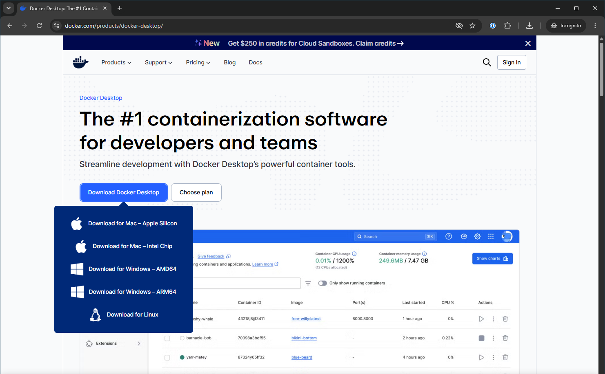
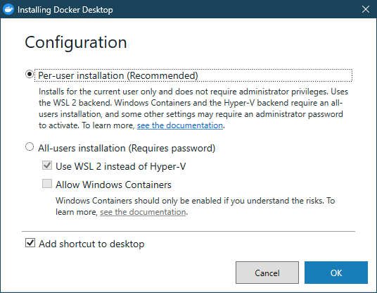
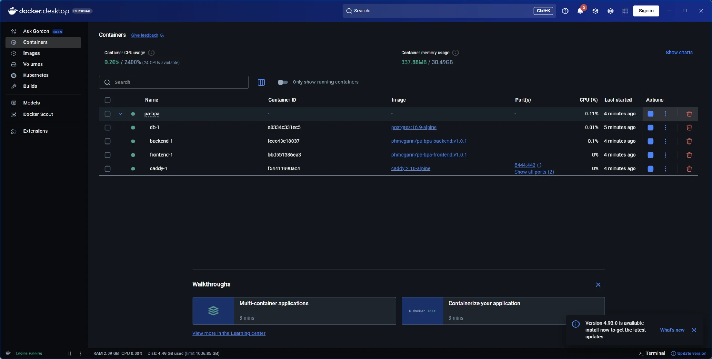
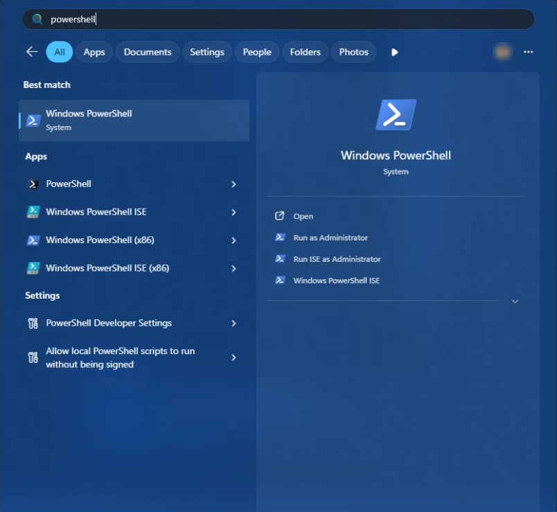
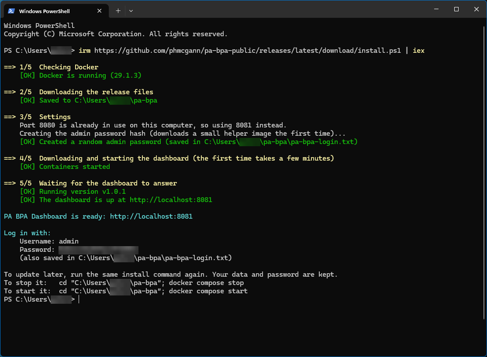
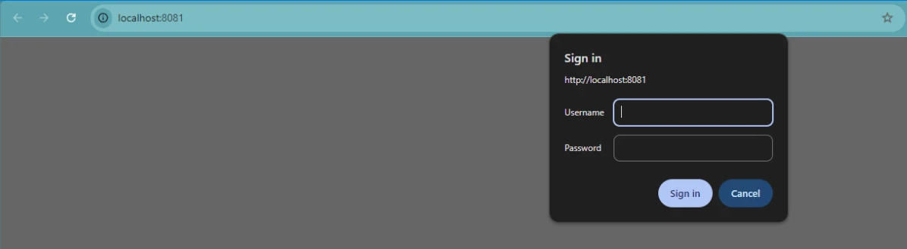
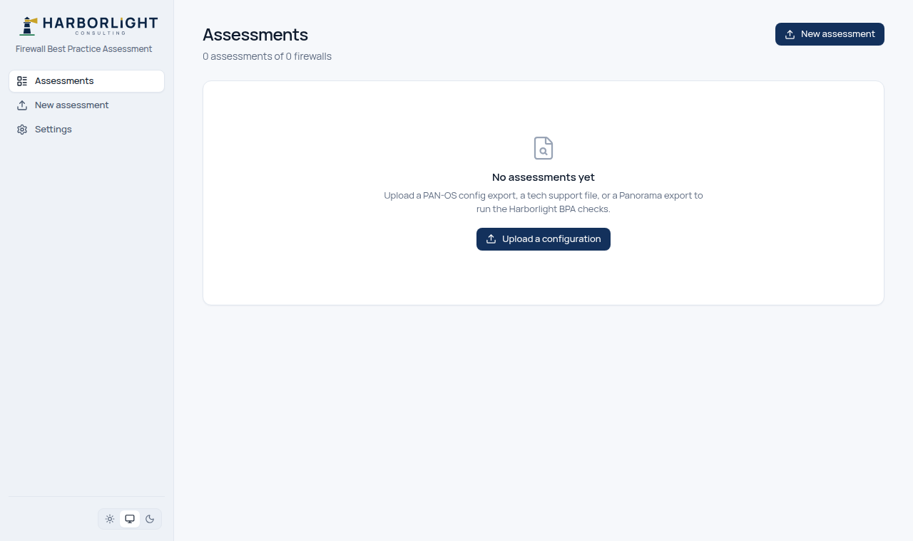
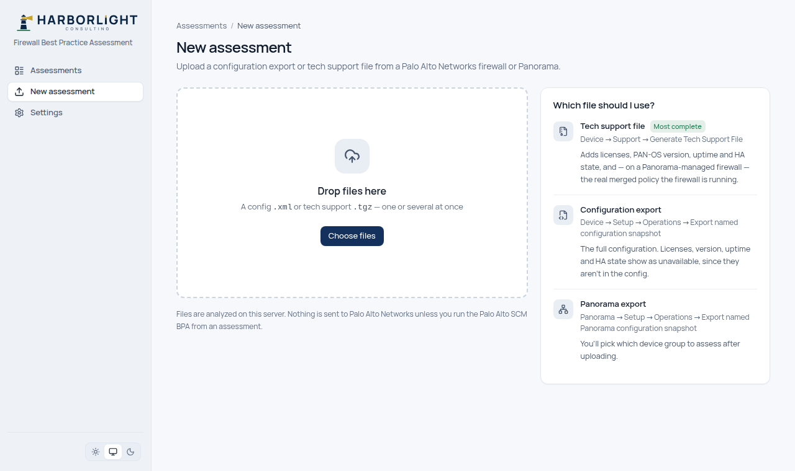

# Installing the PA BPA Dashboard

This guide takes you from a computer with nothing installed to a working dashboard in your browser. Follow the section for your computer, **[Windows](#windows)** or **[macOS](#macos)**, top to bottom. Every click and every command is written out, so there's nothing to guess.

It takes about **20 minutes**, most of it waiting for downloads.

- [What you're installing](#what-youre-installing)
- [Before you start](#before-you-start)
- [Windows](#windows)
- [macOS](#macos)
- [First login](#first-login)
- [Everyday tasks](#everyday-tasks): passwords, stopping, updating, backups, optional settings
- [Deploying on a server](#deploying-on-a-server) (for a team, on a real domain)
- [Uninstalling](#uninstalling)
- [Troubleshooting](#troubleshooting)

---

## What you're installing

The dashboard runs as four small programs ("containers") managed by **Docker Desktop**, a free app from Docker Inc. that runs containers on Windows and macOS:

| Container | What it does |
|---|---|
| `caddy` | The front door. Asks for the password, then passes you through to the dashboard |
| `frontend` | The web pages you see in the browser |
| `backend` | Reads firewall files, runs the checks, stores the results |
| `db` | The database (PostgreSQL) where assessments are kept |

You install Docker Desktop once. After that, **one command** installs the dashboard, and running the same command again later updates it.

By default the dashboard is only reachable **from the computer it's installed on**, at `http://localhost:8080`. Nothing is exposed to your network. Firewall files you upload stay on this computer; nothing is sent anywhere unless you choose to run the optional Palo Alto SCM check from an assessment.

## Before you start

You need:

- **A 64-bit computer** with at least **8 GB of memory** (RAM) and **10 GB of free disk space**.
  - **Windows:** Windows 11, or Windows 10 version 22H2 or later.
  - **macOS:** one of the three most recent major versions of macOS, on either an Apple Silicon (M1 or later) or Intel Mac.
- **An account with administrator rights** on the computer, to install Docker Desktop. If you use a work computer where you can't install software, ask your IT team to install **Docker Desktop** for you, then continue from the step after installing it.
- **An internet connection**, for the downloads.

> **Docker Desktop licensing.** Docker Desktop is free for personal use, education, non-commercial open-source projects, and businesses with **fewer than 250 employees and less than US $10 million in annual revenue**. Larger organizations need a paid Docker subscription to use it. Check [Docker's pricing page](https://www.docker.com/pricing/) if you're unsure.

---

## Windows

### W1. Download Docker Desktop

1. Open your web browser and go to **<https://www.docker.com/products/docker-desktop/>**.
2. Click **Download Docker Desktop**, then choose **Download for Windows – AMD64**. (Only choose **ARM64** if your computer has a Qualcomm Snapdragon processor; almost all Windows PCs are AMD64.)
3. Wait for the file **`Docker Desktop Installer.exe`** to finish downloading. It's about 500 MB.



### W2. Install Docker Desktop

1. Open your **Downloads** folder and double-click **`Docker Desktop Installer.exe`**.
2. If Windows asks **"Do you want to allow this app to make changes to your device?"**, click **Yes**.
3. On the **Configuration** screen, leave **Per-user installation (Recommended)** selected. It needs no administrator password and uses WSL 2, which is what the dashboard needs. Leave **Add shortcut to desktop** ticked and click **OK**.
   (Older versions of the installer don't have this choice. They show a **"Use WSL 2 instead of Hyper-V"** box instead: make sure it's ticked, then click **Ok**. If you choose **All-users installation**, keep **Use WSL 2 instead of Hyper-V** ticked and **Allow Windows Containers** unticked.)

   

4. Wait while it installs. This takes a few minutes.
5. When it says **Installation succeeded**, click **Close and restart** (or **Close**, then restart your computer yourself from the Start menu). **Restarting is required.**

### W3. Start Docker Desktop for the first time

1. After the restart, Docker Desktop usually starts by itself. If it doesn't, click **Start**, type **Docker Desktop**, and click it.
2. The **Docker Subscription Service Agreement** appears. Read it and click **Accept**.
3. You may be asked to sign in or create a Docker account. **You don't need an account.** Click **Skip** (or **Continue without signing in**). If it asks survey questions, you can skip those too.
4. If a window says **WSL needs updating**, or asks you to install or update WSL, follow its button. If it asks you to run a command instead, open **PowerShell** (see step W4) and run:
   ```powershell
   wsl --update
   ```
   then restart the computer and open Docker Desktop again.
5. Wait until the bottom-left corner of the Docker Desktop window shows **Engine running** with a green indicator. The first start can take a few minutes.



> If Docker Desktop shows an error about **virtualization** being disabled, see [Troubleshooting](#virtualization-is-disabled-windows).

### W4. Open PowerShell

1. Click **Start** (the Windows logo), type **PowerShell**, and click **Windows PowerShell**. You do **not** need "Run as administrator".
2. A window with a blue or black background opens, with a line ending in `>`. This is where you'll paste the install command.



### W5. Run the installer

1. Copy this whole line (select it and press **Ctrl + C**, or use the copy button when viewing this page on GitHub):

   ```powershell
   irm https://github.com/phmcgann/pa-bpa-public/releases/latest/download/install.ps1 | iex
   ```

2. Click inside the PowerShell window, **paste** (press **Ctrl + V**, or right-click), and press **Enter**.
3. The installer prints five numbered steps as it works:
   - **1/5 Checking Docker**: confirms Docker Desktop is running, and starts it if not.
   - **2/5 Downloading the release files**: into the folder `C:\Users\<your name>\pa-bpa`.
   - **3/5 Settings**: creates your login with a random password.
   - **4/5 Downloading and starting the dashboard**: the first time this downloads about 500 MB and takes a few minutes.
   - **5/5 Waiting for the dashboard to answer**
4. When it finishes, it prints **PA BPA Dashboard is ready**, shows your **username** (`admin`) and **password**, and opens your browser.

   **Write the password down or keep the file:** it's also saved in `C:\Users\<your name>\pa-bpa\pa-bpa-login.txt`.



> If Windows Defender Firewall asks whether to allow **Docker Desktop** or **com.docker.backend** to communicate, click **Allow**. The dashboard itself only listens on your own computer.

Continue with **[First login](#first-login)**.

---

## macOS

### M1. Find out which kind of Mac you have

1. Click the **Apple menu**  (top-left of the screen) → **About This Mac**.
2. Look at the line labelled **Chip** or **Processor**:
   - **Chip: Apple M1**, **M2**, **M3**, **M4** (or later): you have an **Apple Silicon** Mac.
   - **Processor: … Intel …**: you have an **Intel** Mac.

### M2. Download Docker Desktop

1. Open Safari (or any browser) and go to **<https://www.docker.com/products/docker-desktop/>**.
2. Click **Download Docker Desktop**, then choose **Download for Mac – Apple Silicon** or **Download for Mac – Intel Chip**, matching step M1.
3. Wait for **`Docker.dmg`** to finish downloading. It's about 500 MB.

> 📷 **Screenshot to add: `docs/images/install/mac-01-download.png`**, Docker's download page with the two Mac download options visible.

### M3. Install Docker Desktop

1. Open your **Downloads** folder and double-click **`Docker.dmg`**.
2. In the window that opens, **drag the Docker whale icon onto the Applications folder** icon.

   > 📷 **Screenshot to add: `docs/images/install/mac-02-drag-to-applications.png`**, the Docker.dmg window showing the drag-to-Applications step.

3. Wait for the copy to finish, then close that window.

### M4. Start Docker Desktop for the first time

1. Open **Finder** → **Applications**, and double-click **Docker**.
2. macOS asks **"Docker" is an app downloaded from the Internet. Are you sure you want to open it?** Click **Open**.
3. The **Docker Subscription Service Agreement** appears. Read it and click **Accept**.
4. If asked how to configure Docker Desktop, choose **Use recommended settings (requires password)**, click **Finish**, and enter your **Mac login password** when asked.
5. You may be asked to sign in or create a Docker account. **You don't need an account.** Click **Skip** (or **Continue without signing in**), and skip any survey.
6. Wait until the Docker Desktop window shows **Engine running** (bottom-left) and the **whale icon** in the menu bar at the top of the screen stops animating.

> 📷 **Screenshot to add: `docs/images/install/mac-03-engine-running.png`**, Docker Desktop showing **Engine running**, with the whale icon in the menu bar.

### M5. Open Terminal

1. Press **Command (⌘) + Space** to open Spotlight, type **Terminal**, and press **Return**.
   (Or open **Finder** → **Applications** → **Utilities** → **Terminal**.)
2. A window opens with a line ending in `%` or `$`. This is where you'll paste the install command.

### M6. Run the installer

1. Copy this whole line (select it and press **⌘ + C**, or use the copy button when viewing this page on GitHub):

   ```bash
   curl -fsSL https://github.com/phmcgann/pa-bpa-public/releases/latest/download/install.sh | bash
   ```

2. Click inside the Terminal window, **paste** with **⌘ + V**, and press **Return**.
3. The installer prints five numbered steps as it works:
   - **1/5 Checking Docker**: confirms Docker Desktop is running, and starts it if not.
   - **2/5 Downloading the release files**: into the folder `pa-bpa` in your home folder.
   - **3/5 Settings**: creates your login with a random password.
   - **4/5 Downloading and starting the dashboard**: the first time this downloads about 500 MB and takes a few minutes.
   - **5/5 Waiting for the dashboard to answer**
4. When it finishes, it prints **PA BPA Dashboard is ready**, shows your **username** (`admin`) and **password**, and opens your browser.

   **Write the password down or keep the file:** it's also saved in `~/pa-bpa/pa-bpa-login.txt` (in Finder: **Go** → **Home** → **pa-bpa**).

> 📷 **Screenshot to add: `docs/images/install/mac-04-installer-done.png`**, the Terminal window after the installer finished, showing "PA BPA Dashboard is ready" and the login (blur the password).

Continue with **[First login](#first-login)**.

---

## First login

1. Your browser opens **<http://localhost:8080>** by itself. If it didn't, open your browser and type `localhost:8080` into the address bar.
   (If the installer said it used a different port, such as 8081, use that number instead.)
2. The browser asks you to sign in:
   - **Username:** `admin`
   - **Password:** the one the installer printed (also in `pa-bpa-login.txt`).

   

3. You'll see the empty **Assessments** page:

   

4. Click **Upload a configuration** (or **New assessment** in the sidebar) and drop in a firewall file. The page explains which file to use and where to export it from on the firewall or Panorama:

   

**Tip:** bookmark `http://localhost:8080`. The dashboard keeps running in the background whenever Docker Desktop is running, including after a restart.

---

## Everyday tasks

All the commands below are typed into **PowerShell** on Windows or **Terminal** on macOS. Most start by going into the install folder:

| | Command to go into the install folder |
|---|---|
| **Windows (PowerShell)** | `cd $HOME\pa-bpa` |
| **macOS (Terminal)** | `cd ~/pa-bpa` |

### Find your password

Open `pa-bpa-login.txt` in the install folder:

- **Windows:** `notepad $HOME\pa-bpa\pa-bpa-login.txt`
- **macOS:** `open -e ~/pa-bpa/pa-bpa-login.txt`

If you've changed the password since installing, this file still shows the original one.

### Update to the newest version

Run the **same install command** you used to install ([Windows](#w5-run-the-installer), [macOS](#m6-run-the-installer)). It downloads the new version and restarts the dashboard. **Your assessments, notes and password are kept.**

To see which version is running, look at the installer's line **Running version …**.

To install a **specific** version instead of the newest (for example to go back to an earlier one), set it first:

- **Windows:** `$env:PA_BPA_VERSION = "v1.0.0"` then the install command.
- **macOS:** `curl -fsSL https://github.com/phmcgann/pa-bpa-public/releases/latest/download/install.sh | PA_BPA_VERSION=v1.0.0 bash`

All versions and what changed in each are on the [Releases page](https://github.com/phmcgann/pa-bpa-public/releases).

### Stop and start the dashboard

It runs whenever Docker Desktop runs. To stop it without quitting Docker, go into the install folder and run:

```
docker compose stop
```

To start it again:

```
docker compose start
```

Quitting Docker Desktop also stops it; opening Docker Desktop starts it again.

### Change the password

1. Go into the install folder.
2. Create the new password's hash (replace `Your-New-Password` with the password you want; keep the quotes):
   ```
   docker run --rm caddy:2.10-alpine caddy hash-password --plaintext 'Your-New-Password'
   ```
   It prints one long line starting with `$2a$14$`. Copy that whole line.
3. Open the settings file:
   - **Windows:** `notepad .env`
   - **macOS:** `open -e .env`
4. Find the line starting `BASIC_AUTH_HASH=` and replace everything after the `=` with the new line, **inside single quotes**, like this:
   ```
   BASIC_AUTH_HASH='$2a$14$...the whole line you copied...'
   ```
   The single quotes are required. Without them the password silently stops working.
5. Save the file and close the editor.
6. Apply it:
   ```
   docker compose up -d
   ```
7. Reload the dashboard in your browser and sign in with the new password. (Also update `pa-bpa-login.txt` if you keep your password there.)

### Back up your assessments

Go into the install folder, then run these two commands. They save everything to `pa-bpa-backup.sql` in the install folder:

```
docker compose exec -T db pg_dump -U pabpa -d pabpa --clean --if-exists -f /tmp/pa-bpa-backup.sql
docker compose cp db:/tmp/pa-bpa-backup.sql ./pa-bpa-backup.sql
```

Copy `pa-bpa-backup.sql` somewhere safe. It contains the firewall data you've uploaded, so treat it like the firewall files themselves.

### Restore from a backup

Put `pa-bpa-backup.sql` in the install folder, go into the folder, and run:

```
docker compose cp ./pa-bpa-backup.sql db:/tmp/pa-bpa-restore.sql
docker compose exec -T db psql -q -U pabpa -d pabpa -f /tmp/pa-bpa-restore.sql
```

This **replaces** the current assessments with the ones in the backup. Reload the dashboard afterwards.

### Optional: run Palo Alto's own BPA (Strata Cloud Manager)

An assessment can also be sent to Palo Alto Networks' own Best Practice Assessment in Strata Cloud Manager (SCM), shown alongside the dashboard's findings. It needs an SCM **service account** (in SCM: **Identity & Access** → **Service Accounts**) with the **Network Administrator** and **Security Administrator** roles, and your **Tenant Service Group (TSG) ID**.

1. Go into the install folder and open `.env` (see [Change the password](#change-the-password), step 3).
2. Fill in the three lines:
   ```
   SCM_CLIENT_ID=the service account's client ID
   SCM_CLIENT_SECRET=the service account's client secret
   SCM_TSG_ID=your TSG ID
   ```
3. Save, then run `docker compose up -d`.
4. Each assessment's **Palo Alto SCM** tab now has a **Run** button. Running it sends that configuration to Palo Alto Networks (it's deleted after processing); nothing is sent unless you click it.

### Optional: no internet access

The dashboard downloads Palo Alto Networks' public list of PAN-OS security advisories twice a day, to flag known vulnerabilities in each firewall's PAN-OS version. On a computer without internet access, set `PAN_ADVISORY_FEED=off` in `.env` and run `docker compose up -d`.

---

## Deploying on a server

For a team to share one dashboard, install it on a server and give it a proper web address with HTTPS. This needs:

- A **Linux server** (for example Ubuntu 24.04) with at least 2 CPUs, 4 GB of memory and 20 GB of disk, reachable by your team.
- A **domain name** you control (for example `pabpa.example.com`), with a DNS **A record** pointing at the server's IP address.
- **Ports 80 and 443** open to the server. The HTTPS certificate is issued automatically by Let's Encrypt, which needs to reach port 80.

Steps:

1. **Install Docker Engine** by following Docker's official guide for your Linux distribution: <https://docs.docker.com/engine/install/>. Then confirm it works:
   ```bash
   sudo docker run --rm hello-world
   ```
   To run Docker without `sudo`, add your user to the `docker` group and log out and back in:
   ```bash
   sudo usermod -aG docker "$USER"
   ```
2. **Run the installer** (the same as macOS; it works on Linux):
   ```bash
   curl -fsSL https://github.com/phmcgann/pa-bpa-public/releases/latest/download/install.sh | PA_BPA_NO_BROWSER=1 bash
   ```
   Note the password it prints (also in `~/pa-bpa/pa-bpa-login.txt`).
3. **Put it on your domain.** Edit the settings:
   ```bash
   cd ~/pa-bpa
   nano .env
   ```
   Change these three lines (use your own domain):
   ```
   SITE_ADDRESS=pabpa.example.com
   HTTP_BIND=80
   HTTPS_BIND=443
   ```
   Save (**Ctrl + O**, **Enter**) and exit (**Ctrl + X**).
4. **Apply it:**
   ```bash
   docker compose up -d
   ```
5. Open **https://pabpa.example.com** from any computer and sign in as `admin`. The first visit can take up to a minute while the certificate is issued.

Updating works the same as on a desktop: re-run the step 2 command. Your `.env` changes are kept.

**Access control.** Everyone signs in with the same username and password; the dashboard doesn't have individual accounts yet. Consider limiting who can reach the server at all (a VPN, or a firewall rule allowing only your offices' addresses) rather than exposing it to the whole internet. Set up [backups](#back-up-your-assessments) on a schedule, for example with `cron`.

**Reaching it on your local network without a domain.** Setting `HTTP_BIND=0.0.0.0:8080` in `.env` (then `docker compose up -d`) makes it reachable at `http://<this computer's IP>:8080` from other machines. This is plain HTTP, so the password crosses the network unencrypted. Only do this on a network you trust, and prefer the domain setup above.

**Building from source instead.** Developers can run the stack from the source code with `dashboard/docker-compose.yml` (it builds the images locally). See [`dashboard/README.md`](../dashboard/README.md).

---

## Uninstalling

1. Go into the install folder and remove the dashboard. **This permanently deletes all assessments**, so [back up](#back-up-your-assessments) first if you want to keep them:
   ```
   docker compose down -v
   ```
   (Without `-v`, it removes the dashboard but keeps the assessments, so a later install could pick them up again; you'd need to keep the `.env` file too.)
2. Delete the install folder: `pa-bpa` in your user/home folder.
3. Optional, if you don't use Docker for anything else: uninstall Docker Desktop.
   - **Windows:** **Settings** → **Apps** → **Installed apps** → **Docker Desktop** → **Uninstall**.
   - **macOS:** open Docker Desktop → click the **bug** icon (Troubleshoot) → **Uninstall**, then drag **Docker** from **Applications** to the Trash.

---

## Troubleshooting

### The installer says "Docker isn't installed"
Docker Desktop isn't installed, or was installed after the PowerShell/Terminal window was opened. Finish [installing Docker Desktop](#windows), **close the PowerShell/Terminal window, open a new one**, and run the install command again.

### The installer says "Docker didn't become ready"
Open Docker Desktop yourself and wait until it shows **Engine running**, then run the install command again. If Docker Desktop shows an error instead, see the next items, or restart the computer and try again.

### Virtualization is disabled (Windows)
Docker Desktop needs hardware virtualization, which some PCs ship with switched off. Open **Task Manager** (**Ctrl + Shift + Esc**) → **Performance** → **CPU**, and look at **Virtualization**. If it says **Disabled**, it has to be turned on in the PC's firmware (BIOS/UEFI) settings, usually called **Intel VT-x**, **Intel Virtualization Technology** or **AMD SVM**. How to get there differs by manufacturer; search for your PC model plus "enable virtualization", or ask your IT team.

### "WSL 2 installation is incomplete" or WSL errors (Windows)
Open PowerShell and run `wsl --update`, then restart the computer and open Docker Desktop again.

### The installer says a port is in use
Something else on your computer is already using port 8080, so the installer picked the next free one and told you which. Use that number in the address, for example `http://localhost:8081`. It's also in `pa-bpa-login.txt`.

### The browser says "This site can't be reached"
Docker Desktop isn't running, or the dashboard is stopped. Open Docker Desktop and wait for **Engine running**; the dashboard starts with it. If it still doesn't load, go into the install folder and run `docker compose ps`: all four containers should say **running** (or **healthy**). If not, run `docker compose up -d`.

### The browser keeps asking for the password
The username or password is wrong. The username is `admin` and the password is in [`pa-bpa-login.txt`](#find-your-password) (unless you [changed it](#change-the-password)). Passwords are case-sensitive. To stop the browser offering an old saved password, remove it from the browser's saved passwords for `localhost`.

### The installer says "the database from an earlier install" is still there
The install folder (or just its `.env` file) was deleted, but the old assessments are still stored in Docker. The installer stops so it doesn't lose them. Either put your old `.env` back into the install folder and run the install command again, or, to erase the old assessments and start over, run this and then the install command again:
```
docker volume rm pa-bpa_db_data pa-bpa_caddy_data pa-bpa_caddy_config
```

### PowerShell says it can't download the installer (Windows)
On older Windows 10 installations, run this line first, then the install command again:
```powershell
[Net.ServicePointManager]::SecurityProtocol = [Net.ServicePointManager]::SecurityProtocol -bor [Net.SecurityProtocolType]::Tls12
```
On a company network, a web proxy or security software may be blocking downloads from `github.com` or `ghcr.io`; ask your IT team to allow them.

### Anything else
Go into the install folder and run `docker compose logs --tail 100`. The last lines usually say what went wrong. When [reporting a problem](https://github.com/phmcgann/pa-bpa-public/issues), include those lines, your operating system, and the installer's output. **Never include your password, your `.env` file, or firewall files.**
